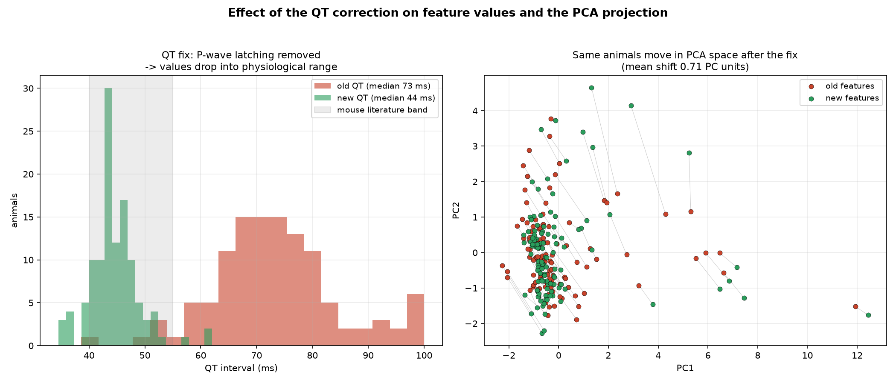

# Corrections and methods — what changed the values, and why the PCA moved

**Purpose.** To document the measurement corrections applied to the pipeline,
their effect on the feature values, and — because several people asked "why did
the PCA change?" — exactly why correcting the values shifts the projection. All
numbers are reproducible from
[`code/corrections_before_after.py`](../code/corrections_before_after.py) on the
recomputed features (n = 117 animals).

> ⚠️ **Note on the notebook's rendered outputs.** The fixes described here are
> applied to the **code** in `02_beat_averaging_and_clustering.ipynb`, but that
> notebook's **stored outputs were not regenerated** — the plots and numbers
> displayed in the committed `.ipynb` still show the **old, pre-fix** values.
> Run **Kernel → Restart Kernel and Run All Cells** to refresh them. The
> corrected values are the ones in this document and in
> `code/corrections_before_after.py`.

---

## 1. QT interval — was over-estimated, now corrected

**The bug.** QT was measured by searching for the T-wave's return to baseline
*after* the R-peak. At mouse heart rates (~500 bpm, RR ≈ 120 ms) that search
window ran **past the next beat** and latched onto the **following beat's
P-wave**, which also sits near baseline — inflating QT.

**The fix.** Bound the return-to-baseline search to the RR interval (it cannot
run into the next beat).

**Effect (old → new):**

| QT metric | old | new | change |
|---|---|---|---|
| median QT | 72.7 ms | **43.9 ms** | −28.9 ms (**39 % lower**) |
| mean QT | 73.4 ms | 44.5 ms | −28.9 ms |
| median QTc | 68.5 ms | **41.2 ms** | into the mouse literature band (~41 ms) |

The corrected QTc lands almost exactly on the published mouse value — strong
external validation that the *new* number, not the old one, is right.

## 2. R-wave amplitude — was under-estimated, now corrected

**The bug.** R amplitude was measured from **zero (baseline) to the R peak**
only, so it missed the S-wave trough and under-reported the true deflection;
it was also read off the averaged template alone.

**The fix.** Measure **peak-to-peak across the QRS window** (max − min over
−15…+35 ms) and average the **per-beat** amplitudes.

**Effect.** Mean error vs the manual LabChart measurements dropped from
**≈ 32.5 % to ≈ 13.9 %**. (QRS duration and QT were confirmed **unchanged** by
this edit — the fix is isolated to amplitude.) The residual ~14 % is attributed
to the 150 Hz bandpass attenuating the sharp R-spike, which is a deliberate
filter trade-off, not a bug.

## 3. Why the PCA moved when the values changed

PCA does not run on raw features — it runs on **standardized** features
(each column mean-centred and scaled to unit variance) and finds the directions
of greatest variance. So when a feature's values change, three things follow:

1. **The column's distribution changes** — halving QT changes its mean and
   spread, so its standardized values change.
2. **The principal axes rotate** — QT no longer pulls the variance the way the
   inflated version did, so PC1/PC2 point in slightly different directions.
3. **Every animal's coordinates move** — measured here as a **mean shift of
   0.71 PC units per animal (max 3.36)** between the old-QT and new-QT
   projections (right panel of the figure; grey lines connect each animal's old
   and new position).

This is expected and correct: the PCA of *wrong* QT values was a picture of a
measurement artifact. The PCA of *corrected* values is the one to trust. It does
**not** change the headline conclusion — the dominant axis is still recording
quality, and the treatment arms still do not separate (see
[why_supervised_is_required.md](why_supervised_is_required.md)) — but the
corrected projection is the defensible one to report.

## 4. Denoising methods that were compared (NB03)

Before settling on the filter, three denoising strategies were benchmarked on a
noisy recording (Animal 107):

| method | result |
|---|---|
| **Butterworth band-pass + 50 Hz notch** | **chosen** |
| Wavelet denoising | rejected |
| Empirical Mode Decomposition (EMD) | rejected |

**Why Butterworth + notch wins:** the dominant noise is **50 Hz mains hum** —
additive and stationary at a fixed frequency, which is exactly what a notch
filter is built to remove (confirmed on the power spectrum). Wavelet and EMD are
designed for **non-stationary / broadband** noise, which isn't the problem here,
so they added complexity without benefit.

---

## Summary

| correction | before | after | why it's right |
|---|---|---|---|
| QT interval | median 72.7 ms | **43.9 ms** | QTc 41.2 ms matches mouse literature |
| R amplitude | ~32.5 % error vs manual | **~13.9 %** | peak-to-peak + per-beat mean |
| Denoising | — | Butterworth + notch | mains hum is stationary/additive |

The value reductions are **corrections of over-estimation**, externally
validated against manual LabChart measurements and the published mouse QTc. The
PCA changed because it is computed on the standardized features — the corrected
projection is the one to report, and it leaves the negative grouping result
intact.
