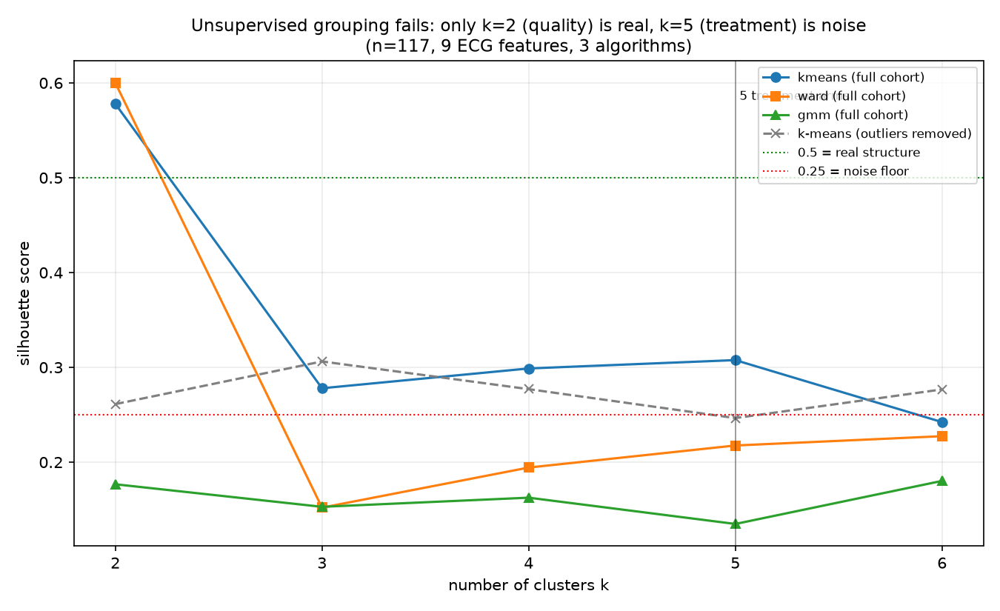

# Why supervised analysis is required — an evidence log

**Purpose.** To document that unsupervised grouping of the ECG recordings was
attempted **exhaustively** and demonstrably does not recover the treatment
structure. The conclusion that supervised analysis (which needs the treatment
labels) is the *only* valid route is therefore an evidence-based finding, not a
default or a shortcut. All numbers below are reproducible from
[`code/unsupervised_justification.py`](../code/unsupervised_justification.py) on
`all_features_recomputed.csv` (n = 117 recordings, 9 ECG features).

Reading the silhouette score: **> 0.50 = real structure**, **0.25–0.50 = weak**,
**< 0.25 = noise (no real grouping).**

---

## What was tried

### Attempts 1–3 — cluster the full cohort with three independent algorithms
k-means, hierarchical (Ward), and Gaussian mixture, at k = 2 … 6.

| k | k-means | Ward | GMM | verdict |
|---|---|---|---|---|
| **2** | 0.578 | **0.600** | 0.177 | **REAL split** |
| 3 | 0.278 | 0.152 | 0.153 | noise |
| 4 | 0.299 | 0.194 | 0.163 | noise |
| **5** *(= 5 treatment arms)* | 0.308 | 0.218 | 0.135 | **noise** |
| 6 | 0.242 | 0.227 | 0.180 | noise |

The only real structure is at **k = 2**, and it separates **clean vs
artifact-laden recordings** (83 vs 34, driven by rhythm irregularity
`rr_cv > 0.15`) — a **data-quality** boundary, not a treatment boundary. At
**k = 5**, where the five treatment arms would appear, every algorithm scores at
the **noise floor**.

### Attempt 4 — remove the quality outliers, then re-cluster
Hypothesis: maybe the treatment groups are hidden *underneath* the quality
outliers. Dropping the k = 2 outlier cluster and re-clustering the clean block:

| k | k-means | Ward | GMM |
|---|---|---|---|
| 2 | 0.261 | 0.183 | 0.362 |
| 3 | 0.306 | 0.203 | 0.118 |
| 4 | 0.277 | 0.207 | 0.069 |
| 5 | 0.247 | 0.209 | 0.165 |
| 6 | 0.277 | 0.248 | 0.136 |

No structure emerges — every score stays at the noise floor. There is **no
hidden treatment grouping** beneath the quality split.

### Attempt 5 — inspect the principal axis
PCA shows **PC1 alone explains 37 % of the variance**, and it is the
**quality axis** (it tracks the irregular-rhythm outliers). The dominant signal
in the data is recording quality; any treatment effect is smaller than that and
than the animal-to-animal biological variability.

### Also tried and reported elsewhere
- **Distance-to-healthy score** (NB04): a continuous, unimodal smear with **no
  natural gap** — cannot be thresholded into healthy/unhealthy classes.
- **Cluster-as-treatment-group**: the recovered clusters map onto artifact, not
  drug — biologically meaningless.

---

## Why this is expected, not a failure

Clustering is **unsupervised**: it splits on the largest axis of variance.
Here that axis is **recording quality**, because any drug effect on the surface
ECG is buried under (1) recording artifact, (2) large inter-animal biological
variability, and (3) a genuinely modest treatment effect. An unsupervised method
has no way to know which variance is "treatment," so it cannot recover labels it
was never given.

## Conclusion

Across **three algorithms × five cluster counts**, an **outlier-removal
re-analysis**, a **PCA variance check**, and a **distance-to-healthy score**, the
only structure that exists is data quality. The treatment groups do **not**
separate on ECG features alone.

Therefore the treatment question — *does ethanolamine protect against
doxorubicin cardiotoxicity?* — can only be answered by **supervised analysis
against the treatment labels**: testing each ECG parameter across the treatment
groups directly, with sex and study as factors, and examining the dose-response
across the three ethanolamine doses. That analysis requires the treatment-group
metadata; until it is released, no supervised result is possible, by
construction.

*This is a genuine, defensible negative result for the unsupervised stage — and
the correct methodological justification for the supervised design.*
